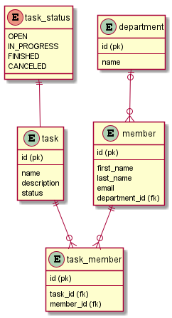
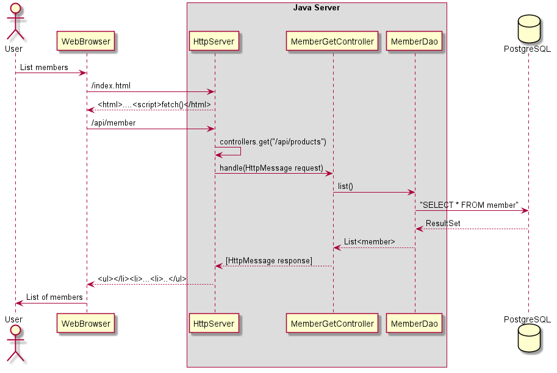

# PGR203 exam HTTP Server 
## Description:
This is a Http-server. The purpose of the code is to host a project site which contains an Index-file, and a project file. Also, to load index .html page as URL-echo

## How to build
run Main method in HttpServer, or run maven package and run the http-1.0-SNAPSHOT.jar
## How to run
Open a browser to the URL below.
URL:` http://localhost:8080`

===

