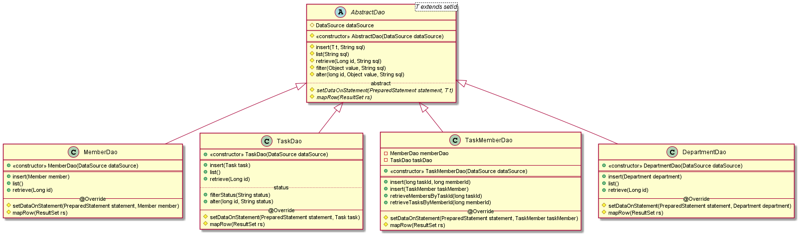
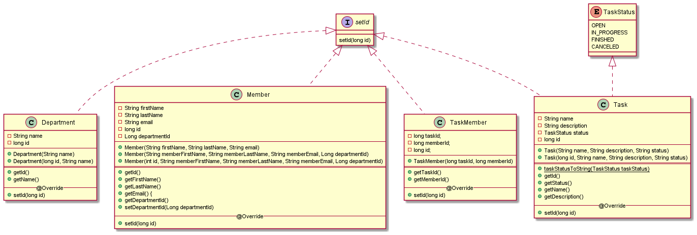

 | [Github Actions](https://github.com/kristiania/pgr203eksamen-97krihop/actions)

# PGR203 exam HTTP Server 
## Description:
This is a Http-server. The code hosts various documents that build up a project management tool. The tool contains functionality like creating project members, departments and tasks. The user can edit them and assign them to each other. The objects are added to a local database. The server also handles a range of other requests (URL-echo etc), and includes client for creating custom requests.

## How to build and run

1. Package with Maven
2. Place .jar in folder containing properties file with database values:
    	- Filename: `pgr203.properties`
    	- Properties: `dataSource.url`, `dataSource.username` and `dataSource.password` 
3. Run .jar file
4. Open a web browser and go to [http://localhost:8080](http://localhost:8080)
5. *High five!*

Alternatively run HttpServer.main and go link listed above.

Database Structure
==

Server Structure
==

Dao Structure
==

ObjectClass Structure
==

